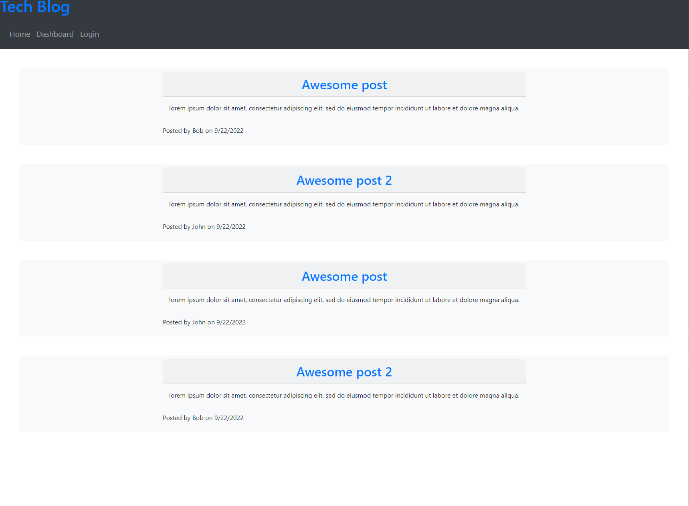

# mvc-tech-blog-app

A tech blog using MVC paradigm

## Description

This is a tech blog app that is using the MVC paradigm folder structure. You can view blog posts of users on the homepage, comment on a post, sign in, or sign up, create a new blog post from the dashboard, delete and or update an existing blog post. The app is using bcrypt for password hashing, connect-session-sequelize for connecting session to sequelieze, dotenv for environment variables, express for back end, express handlebars for front end pages, express sessions for sessions, and mysql2 with sequelize.

## Screenshot(s)

## Link to Deployed App

[Deployed App Link](https://radiant-basin-61190.herokuapp.com/)
